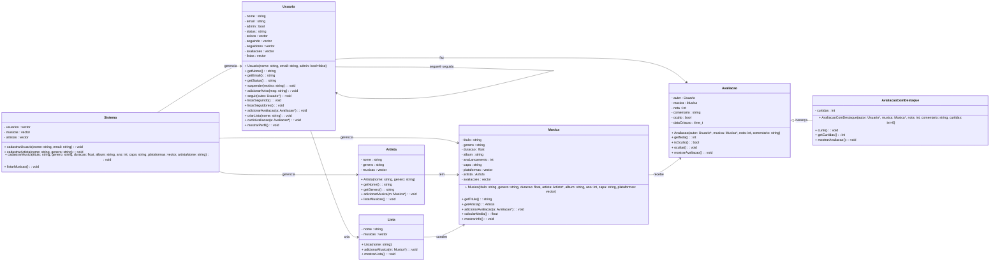

```mermaid
classDiagram
direction LR

class Sistema {
    - usuarios : vector<Usuario*>
    - musicas : vector<Musica*>
    - artistas : vector<Artista*>
    + cadastrarUsuario(nome: string, email: string) : void
    + cadastrarArtista(nome: string, genero: string) : void
    + cadastrarMusica(titulo: string, genero: string, duracao: float, album: string, ano: int, capa: string, plataformas: vector<string>, artistaNome: string) : void
    + listarMusicas() : void
}

class Usuario {
    - nome : string
    - email : string
    - admin : bool
    - status : string
    - avisos : vector<string>
    - seguindo : vector<Usuario*>
    - seguidores : vector<Usuario*>
    - avaliacoes : vector<Avaliacao*>
    - listas : vector<Lista*>
    + Usuario(nome: string, email: string, admin: bool=false)
    + getNome() : string
    + getEmail() : string
    + getStatus() : string
    + suspender(motivo: string) : void
    + adicionarAviso(msg: string) : void
    + seguir(outro: Usuario*) : void
    + listarSeguindo() : void
    + listarSeguidores() : void
    + adicionarAvaliacao(a: Avaliacao*) : void
    + criarLista(nome: string) : void
    + curtirAvaliacao(a: Avaliacao*) : void
    + mostrarPerfil() : void
}

class Lista {
    - nome : string
    - musicas : vector<Musica*>
    + Lista(nome: string)
    + adicionarMusica(m: Musica*) : void
    + mostrarLista() : void
}

class Artista {
    - nome : string
    - genero : string
    - musicas : vector<Musica*>
    + Artista(nome: string, genero: string)
    + getNome() : string
    + getGenero() : string
    + adicionarMusica(m: Musica*) : void
    + listarMusicas() : void
}

class Musica {
    - titulo : string
    - genero : string
    - duracao : float
    - album : string
    - anoLancamento : int
    - capa : string
    - plataformas : vector<string>
    - artista : Artista*
    - avaliacoes : vector<Avaliacao*>
    + Musica(titulo: string, genero: string, duracao: float, artista: Artista*, album: string, ano: int, capa: string, plataformas: vector<string>)
    + getTitulo() : string
    + getArtista() : Artista*
    + adicionarAvaliacao(a: Avaliacao*) : void
    + calcularMedia() : float
    + mostrarInfo() : void
}

class Avaliacao {
    - autor : Usuario*
    - musica : Musica*
    - nota : int
    - comentario : string
    - oculto : bool
    - dataCriacao : time_t
    + Avaliacao(autor: Usuario*, musica: Musica*, nota: int, comentario: string)
    + getNota() : int
    + isOculto() : bool
    + ocultar() : void
    + mostrarAvaliacao() : void
}

class AvaliacaoComDestaque {
    - curtidas : int
    + AvaliacaoComDestaque(autor: Usuario*, musica: Musica*, nota: int, comentario: string, curtidas: int=0)
    + curtir() : void
    + getCurtidas() : int
    + mostrarAvaliacao() : void
}

%% Relações e heranças

Sistema --> Usuario : gerencia
Sistema --> Musica : gerencia
Sistema --> Artista : gerencia

Usuario --> Lista : cria
Usuario --> Avaliacao : faz
Usuario --> Usuario : segue/é seguido
Artista --> Musica : tem
Musica --> Avaliacao : recebe
Avaliacao <|-- AvaliacaoComDestaque : herança

Lista --> Musica : contém

```
